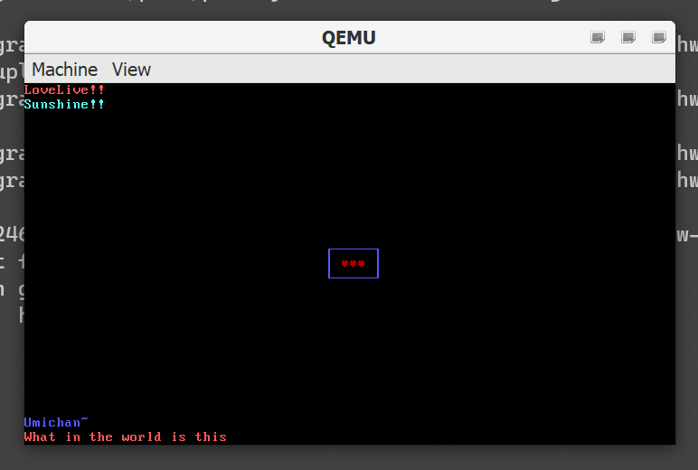

# Weird_bootloader

A sample MBR bootloader loading itself and printing some message on screen.

Apparently I made this on April 2022 (when I was 16), and having found this on my hard drive, I am uploading becasue I have no idea what in the world I made this for.

## Features
Prints something on your screen.
'exec.bat' compiles the bootloader using NASM and loads it on QEMU. Using programs like bootice, you can place the generated weirdboot.bin onto your USB stick etc to actually boot it on your computer. But why?
